# Myra Samples

This page showcases the available samples in the Myra UI toolkit. Each sample demonstrates specific features and capabilities of Myra. All samples are built with MonoGame and can be found in the `samples/` directory of the repository.

## All Widgets

Comprehensive showcase of all available Myra widgets including buttons, checkboxes, text boxes, progress bars, dropdowns, and more. This is the best starting point to see what Myra can do.

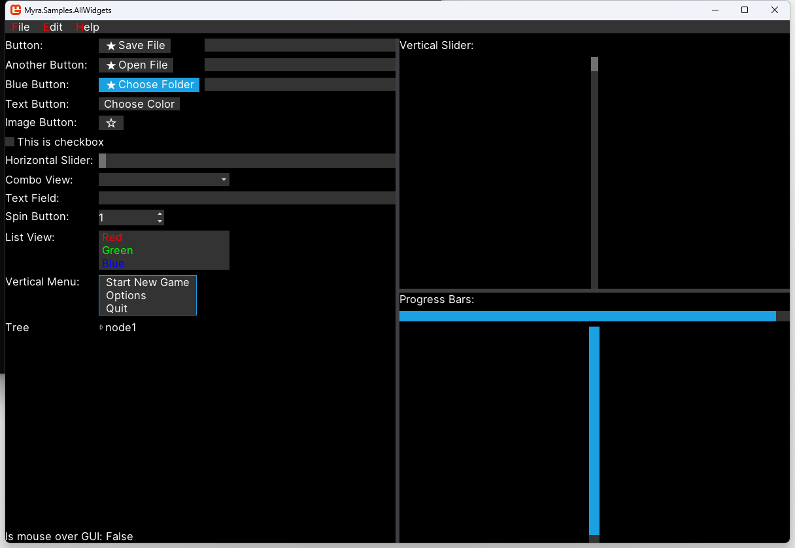

## Asset Management

Demonstrates how to manage and load game assets including textures, fonts, and other resources in Myra. Shows best practices for organizing and accessing assets in your game.

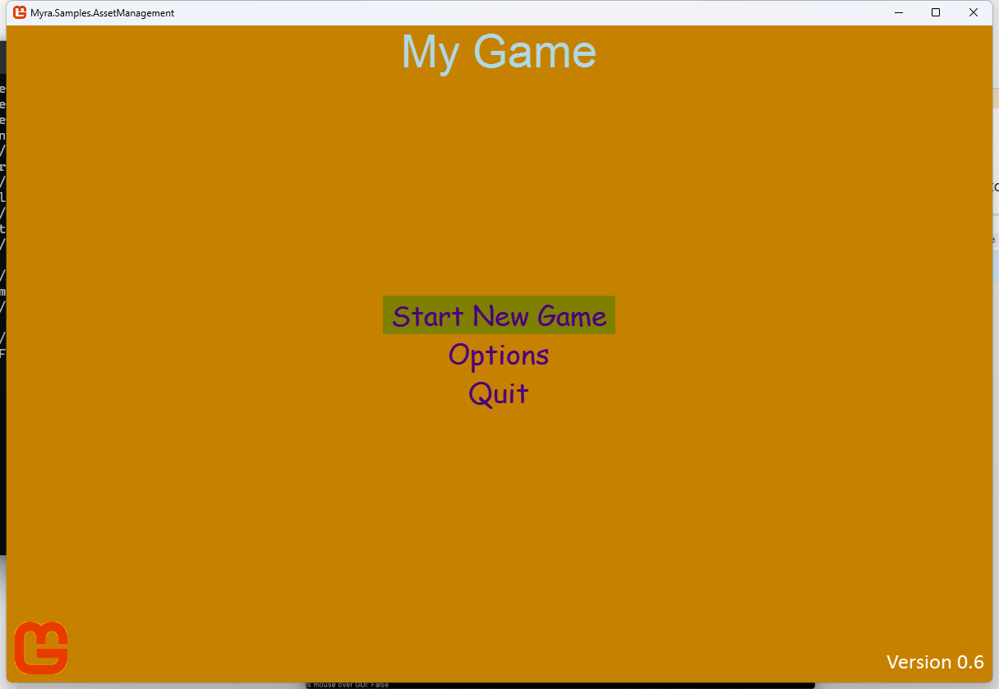

## Custom UI Stylesheet

Shows how to create and apply custom UI stylesheets to customize the appearance of widgets. Learn how to modify colors, fonts, sizes, and other visual properties.

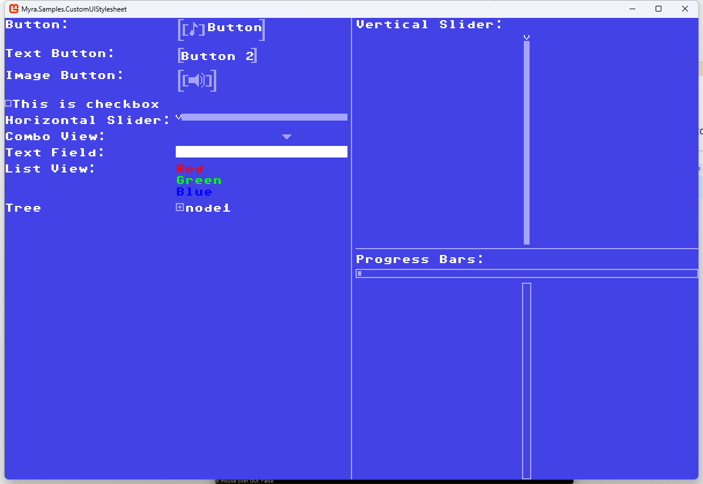

## Custom Widgets - Arrow

Demonstrates creating a custom arrow widget by extending Myra's widget system. A simple example of how to build your own custom widgets.

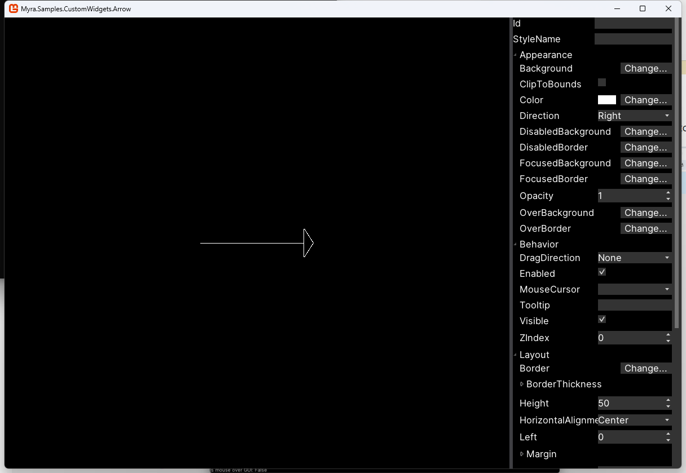

## Custom Widgets - LogView

Example of building a custom log view widget for displaying application logs. Useful for debugging and monitoring game state in real-time.

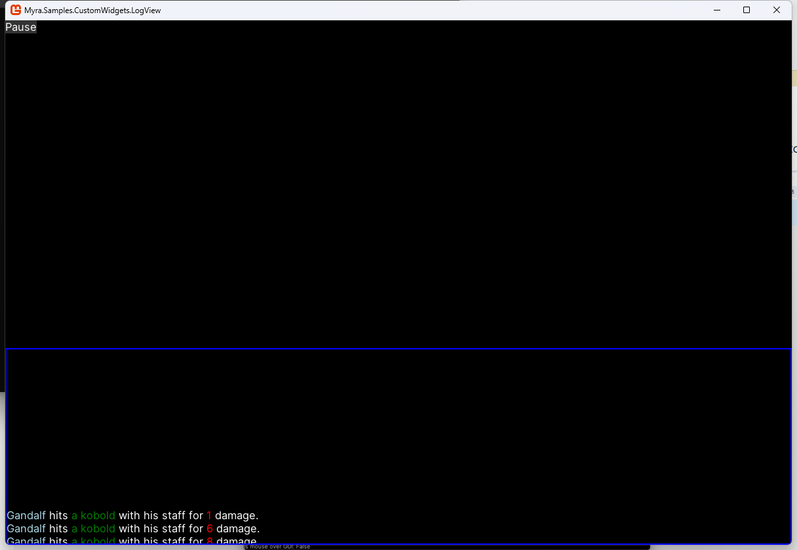

## Custom Widgets - Scene3D

Shows how to embed 3D rendering within Myra UI using custom widgets. Demonstrates integration of 3D graphics with the 2D UI system.

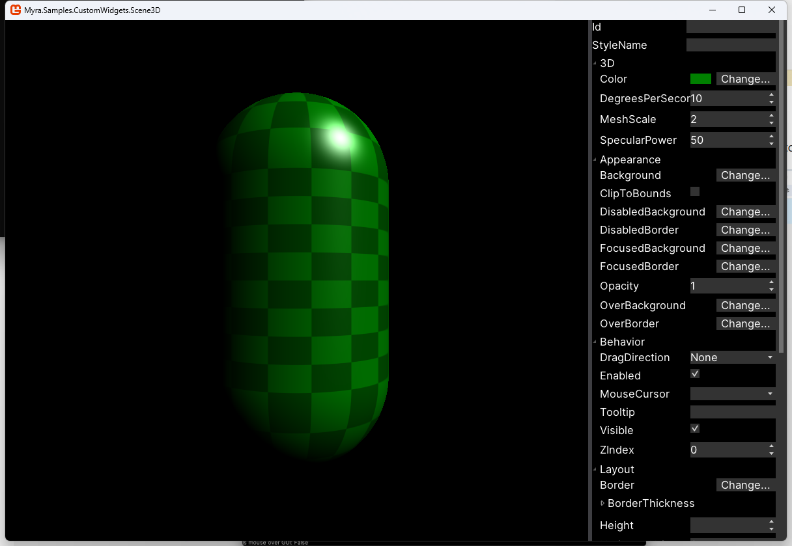

## Debug Console

Demonstrates creating an in-game debug console for development and troubleshooting. Useful for executing commands and viewing debug information during gameplay.

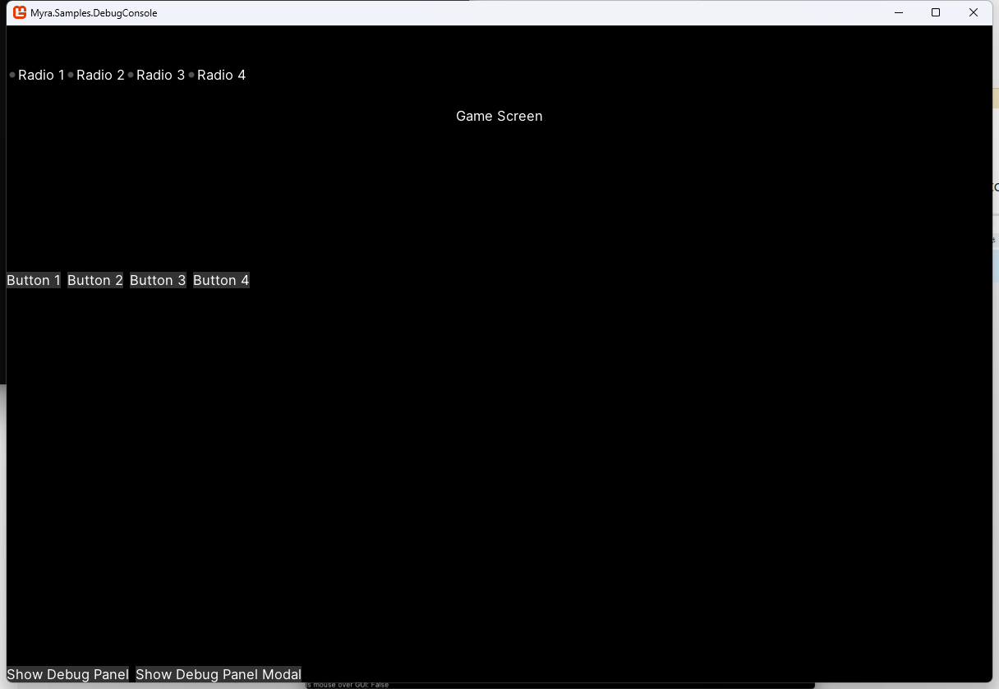

## Grid Container

Shows how to use the Grid layout container for organizing UI elements in rows and columns. Learn to create complex layouts with precise positioning.

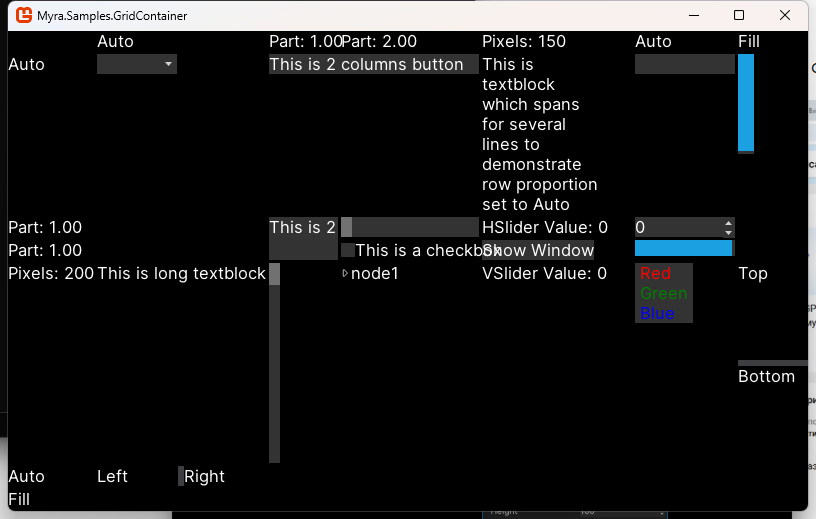

## Layout 2D

Demonstrates 2D layout options and techniques for arranging UI elements. Explores various layout patterns and responsive design approaches.

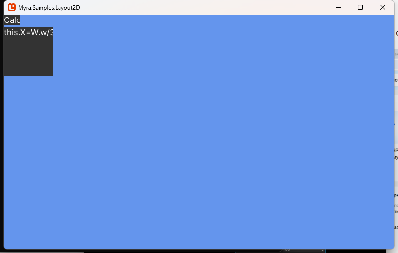

## Non-Modal Windows

Shows how to create and manage non-modal dialog windows in Myra. Multiple windows can be open and interacted with simultaneously.

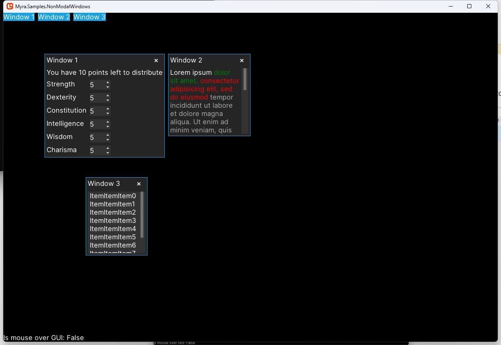

## Notepad

A simple notepad application demonstrating common GUI patterns like menus, dialogs, and text editing. A practical example of building a complete application with Myra.

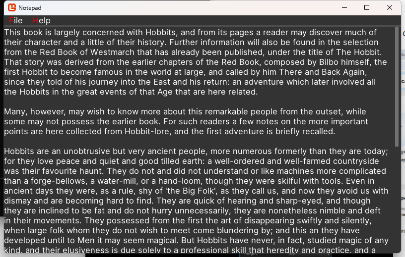

## Object Editor

Shows how to create a property editor for editing object attributes with automatic widget generation. Useful for creating tools and editors.

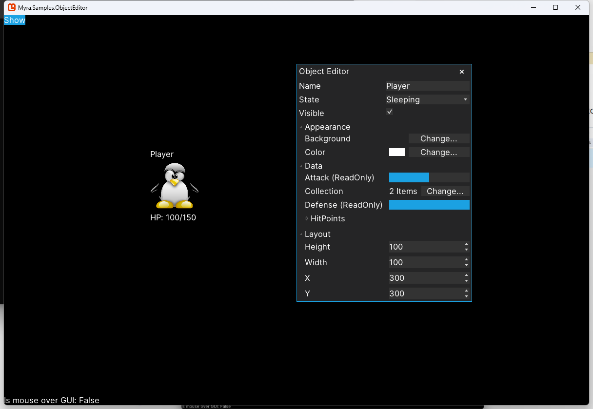

## Split Pane Container

Demonstrates using split pane containers to create resizable UI panels. Learn how to create flexible layouts with user-adjustable sections.

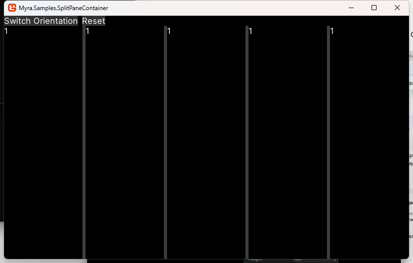

## Text Rendering

Showcases various text rendering capabilities and font options in Myra. Demonstrates different text styles, colors, and formatting options.

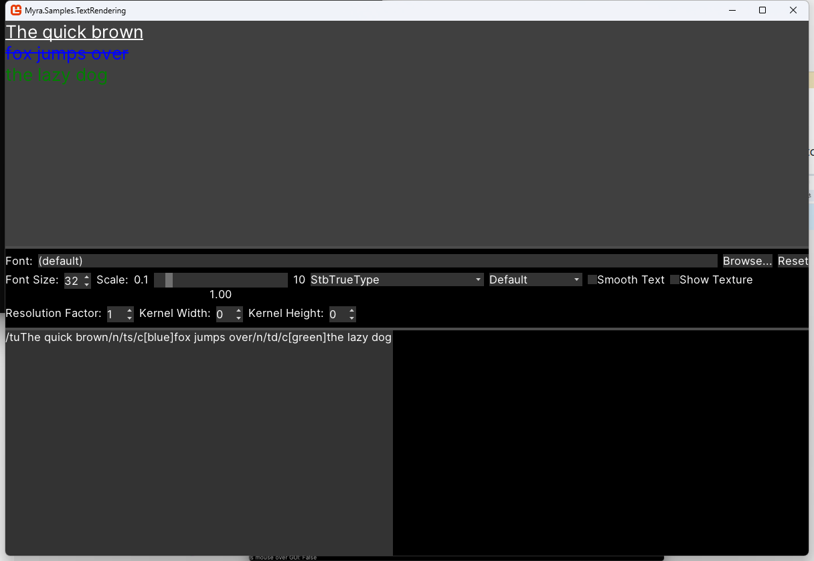

## Viewports

Demonstrates viewport management and rendering to specific regions of the screen. Learn how to organize and manage multiple rendered areas.

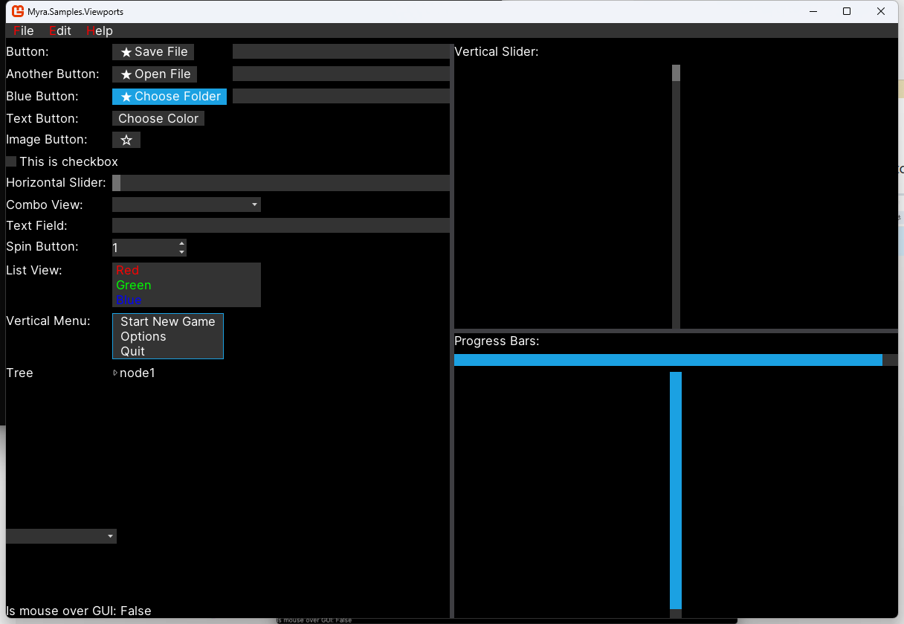

## Running the Samples

All samples can be built and run using the MonoGame solution:

```
dotnet build build/Myra.MonoGame.sln
```

Then navigate to any sample directory and run the executable:

```
./samples/Myra.Samples.AllWidgets/bin/Release/net8.0/Myra.Samples.AllWidgets.exe
```

Each sample is self-contained and can be modified to explore different features and customizations.
